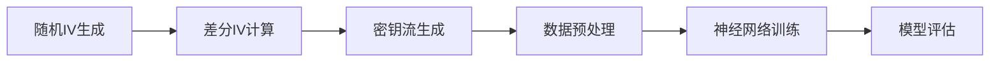

# 流密码差分神经区分器实现文档

## 目录
- [1. 理论基础](#1-理论基础)
- [2. 系统架构](#2-系统架构)
- [3. 具体实现](#3-具体实现)
- [4. 实验结果](#4-实验结果)

## 1. 理论基础

### 1.1 差分分析原理
差分分析基于以下核心概念：
- 利用初始向量（IV）对之间的输入差分
- 分析密钥生成阶段的输出差分性质
- 构造形式：(K,ΔIV)→Δks

### 1.2 神经区分器原理
神经区分器的目标是区分真实密钥流和随机序列。主要特点：
1. 输入：密钥流对或随机序列
2. 输出：二分类结果（真实/随机）
3. 学习目标：捕捉密钥流的统计特征

## 2. 系统架构

### 2.1 总体架构
```python
class CipherNeuralDistinguisher:
    def __init__(self):
        self.data_generator = DataGenerator()
        self.model = ResNetDistinguisher()
        self.trainer = ModelTrainer()

    def run(self):
        # 1. 数据生成
        train_data, test_data = self.data_generator.generate()
        # 2. 模型训练
        self.trainer.train(self.model, train_data)
        # 3. 模型评估
        self.trainer.evaluate(self.model, test_data)
```

### 2.2 数据流图


## 3. 具体实现

### 3.1 数据生成模块
```python
import numpy as np

class DataGenerator:
    def __init__(self, key_size=128, iv_size=96):
        self.key_size = key_size
        self.iv_size = iv_size
    
    def generate_sample(self):
        # 生成随机标签
        label = np.random.randint(0, 2)
        # 生成主密钥
        key = np.random.randint(0, 2, self.key_size)
        # 生成初始IV
        iv0 = np.random.randint(0, 2, self.iv_size)
        # 计算差分IV
        diff = self.get_differential()
        iv1 = iv0 ^ diff
        
        if label == 1:
            # 生成真实密钥流对
            ks0 = self.generate_keystream(key, iv0)
            ks1 = self.generate_keystream(key, iv1)
            sample = np.concatenate([ks0, ks1])
        else:
            # 生成随机序列
            sample = np.random.randint(0, 2, 512)
            
        return sample, label
    
    def get_differential(self):
        # 实现差分模式
        return np.zeros(self.iv_size)  # 具体差分需要根据攻击模式设计
    
    def generate_keystream(self, key, iv):
        # 实现Grain128a的密钥流生成
        # 这里需要实现具体的密码算法
        pass
```

### 3.2 神经网络模型
```python
import tensorflow as tf
from tensorflow.keras import layers, Model

class ResNetDistinguisher(Model):
    def __init__(self, filters=4, depth=17, kernel_size=11):
        super().__init__()
        self.filters = filters
        self.depth = depth
        self.kernel_size = kernel_size
        
        # 初始卷积层
        self.conv1 = layers.Conv1D(
            filters=self.filters,
            kernel_size=self.kernel_size,
            padding='same'
        )
        
        # 残差块
        self.res_blocks = []
        for i in range(depth):
            dilation_rate = 2 ** (i % 4)
            self.res_blocks.append(
                self.build_residual_block(dilation_rate)
            )
        
        # 输出层
        self.flatten = layers.Flatten()
        self.dense1 = layers.Dense(550, activation='relu')
        self.dense2 = layers.Dense(1, activation='sigmoid')
    
    def build_residual_block(self, dilation_rate):
        return {
            'conv1': layers.Conv1D(
                filters=self.filters,
                kernel_size=self.kernel_size,
                padding='same',
                dilation_rate=dilation_rate
            ),
            'bn1': layers.BatchNormalization(),
            'conv2': layers.Conv1D(
                filters=self.filters,
                kernel_size=self.kernel_size,
                padding='same',
                dilation_rate=dilation_rate
            ),
            'bn2': layers.BatchNormalization()
        }
    
    def call(self, inputs):
        x = self.conv1(inputs)
        
        # 残差块处理
        for block in self.res_blocks:
            identity = x
            x = block['conv1'](x)
            x = block['bn1'](x)
            x = tf.nn.relu(x)
            x = block['conv2'](x)
            x = block['bn2'](x)
            x = tf.nn.relu(x + identity)
        
        x = self.flatten(x)
        x = self.dense1(x)
        return self.dense2(x)
```

### 3.3 训练模块
```python
class ModelTrainer:
    def __init__(self, batch_size=100, epochs=50):
        self.batch_size = batch_size
        self.epochs = epochs
        self.optimizer = tf.keras.optimizers.Adam(
            learning_rate=0.00306
        )
        
    def train(self, model, train_data):
        model.compile(
            optimizer=self.optimizer,
            loss='binary_crossentropy',
            metrics=['accuracy']
        )
        
        history = model.fit(
            train_data[0],
            train_data[1],
            batch_size=self.batch_size,
            epochs=self.epochs,
            validation_split=0.2
        )
        
        return history
```

## 4. 实验结果

### 4.1 训练参数
最优超参数配置：
```python
params = {
    'n_filters': 4,
    'depth': 17,
    'kernel_size': 11,
    'n_neurons': 550,
    'batch_size': 100,
    'reg_param': 6.49e-05,
    'lr_high': 0.00306,
    'lr_low': 4.15e-05
}
```

### 4.2 性能指标
- 训练准确率：接近1.0
- 验证准确率：稳定
- 训练损失：持续下降

### 4.3 使用示例
```python
# 初始化系统
distinguisher = CipherNeuralDistinguisher()

# 生成训练数据
train_samples = 1000000
train_data = distinguisher.data_generator.generate_batch(train_samples)

# 训练模型
history = distinguisher.trainer.train(
    distinguisher.model,
    train_data
)

# 评估模型
test_samples = 100000
test_data = distinguisher.data_generator.generate_batch(test_samples)
results = distinguisher.model.evaluate(test_data[0], test_data[1])
```

## 5. 注意事项

1. 数据生成
   - 确保IV差分模式的正确性
   - 注意数据的平衡性

2. 模型训练
   - 监控验证损失避免过拟合
   - 适时调整学习率

3. 评估指标
   - 关注模型的泛化能力
   - 验证在不同差分模式下的性能

## 6. 未来改进方向

1. 模型优化
   - 探索更高效的网络架构
   - 改进特征提取能力

2. 性能提升
   - 优化数据生成效率
   - 提高训练速度

3. 应用扩展
   - 支持更多流密码算法
   - 增加差分模式的多样性